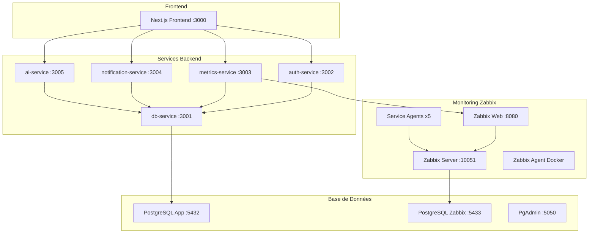

# Infrastructure Docker - SupervIA

**Architecture containérisée complète avec Zabbix intégré et optimisations de build avancées**

## 📋 Vue d'ensemble

L'infrastructure SupervIA est entièrement containérisée avec Docker Compose, incluant un système de monitoring Zabbix complet, deux bases de données PostgreSQL séparées, et tous les services applicatifs optimisés pour la production.

## 🏗️ Architecture des Services

### Stack complète


## 🐳 Configuration Docker Compose

### Services de base de données

#### PostgreSQL Application
```yaml
postgres:
  image: postgres:17-alpine
  container_name: supervia_postgres_app
  environment:
    POSTGRES_USER: ${POSTGRES_USER}
    POSTGRES_PASSWORD: ${POSTGRES_PASSWORD}
    POSTGRES_DB: ${POSTGRES_DB}
  volumes:
    - postgres_app_data:/var/lib/postgresql/data
  ports:
    - "5432:5432"
  healthcheck:
    test: ["CMD-SHELL", "pg_isready -U ${POSTGRES_USER} -d ${POSTGRES_DB}"]
    interval: 10s
    timeout: 5s
    retries: 5
  restart: unless-stopped
```

**Fonctionnalités** :
- **Version** : PostgreSQL 17 Alpine (optimisé)
- **Health check** : Vérification automatique de disponibilité
- **Persistence** : Volume Docker pour les données
- **Port exposé** : 5432 pour accès direct

#### PostgreSQL Zabbix (séparé)
```yaml
zabbix-db:
  image: postgres:17-alpine
  container_name: supervia_postgres_zabbix
  ports:
    - "5433:5432"  # Port différent pour éviter les conflits
```

**Isolation** :
- **Base séparée** : Évite les conflits avec l'application
- **Port 5433** : Accès dédié pour debug
- **Schema Zabbix** : Configuration automatique par zabbix-server

#### PgAdmin
```yaml
pgadmin:
  image: dpage/pgadmin4
  environment:
    PGADMIN_DEFAULT_EMAIL: admin@supervia.com
    PGLADMIN_DEFAULT_PASSWORD: admin
  ports:
    - "5050:80"
  depends_on:
    postgres:
      condition: service_healthy
    zabbix-db:
      condition: service_healthy
```

### Stack Zabbix complète

#### Zabbix Server
```yaml
zabbix-server:
  image: zabbix/zabbix-server-pgsql:latest
  ports:
    - "10051:10051"  # Port standard Zabbix
  environment:
    DB_SERVER_HOST: "zabbix-db"
    POSTGRES_USER: ${ZABBIX_DB_USER}
    POSTGRES_PASSWORD: ${ZABBIX_DB_PASSWORD}
    POSTGRES_DB: ${ZABBIX_DB_NAME}
  depends_on:
    zabbix-db:
      condition: service_healthy
```

#### Zabbix Web Interface
```yaml
zabbix-web:
  image: zabbix/zabbix-web-nginx-pgsql:latest
  ports:
    - "8080:8080"   # Interface web
    - "8443:8443"   # HTTPS
  environment:
    DB_SERVER_HOST: "zabbix-db"
    ZBX_SERVER_HOST: "zabbix-server"
```

#### Architecture des Agents

**Template YAML** pour factorisation :
```yaml
x-zabbix-agent-base: &zabbix-agent-base
  image: zabbix/zabbix-agent:latest
  restart: unless-stopped
  depends_on:
    - zabbix-server
```

**Agent Docker Host** :
```yaml
zabbix-agent:
  image: zabbix/zabbix-agent:latest
  environment:
    ZBX_HOSTNAME: "Docker Host"
    ZBX_SERVER_HOST: "zabbix-server"
  privileged: true  # Accès aux métriques système
  volumes:
    - /var/run/docker.sock:/var/run/docker.sock  # Monitoring Docker
```

**Agents par service** :
```yaml
db-service-zabbix-agent:
  <<: *zabbix-agent-base
  environment:
    ZBX_SERVER_HOST: "zabbix-server"
    ZBX_HOSTNAME: "DB Service"

auth-service-zabbix-agent:
  <<: *zabbix-agent-base
  environment:
    ZBX_HOSTNAME: "Auth Service"
# ... et ainsi de suite pour chaque service
```

### Services applicatifs SupervIA

#### Pattern commun des services backend
```yaml
db-service:
  build:
    context: ./backend/db-service
    dockerfile: Dockerfile
  container_name: supervia_db_service
  ports:
    - "3001:3000"
  env_file: ./.env  # Variables partagées
  depends_on:
    postgres:
      condition: service_healthy
  restart: unless-stopped
```

**Caractéristiques communes** :
- **Build local** : Dockerfile optimisé par service
- **Variables d'environnement** : Fichier `.env` partagé
- **Health checks** : Dépendances conditionnelles
- **Restart policy** : `unless-stopped` pour la robustesse
- **Ports dédiés** : 3001-3005 pour éviter les conflits

#### Frontend Next.js
```yaml
frontend:
  build:
    context: ./frontend/supervia
    args:
      - NEXT_TELEMETRY_DISABLED=1  # Optimisation build
  container_name: supervia_frontend
  ports:
    - "3000:3000"
  env_file: ./.env
  depends_on:
    - auth-service
    - metrics-service
    - notification-service
    - ai-service
```

**Spécificités frontend** :
- **Build args** : Télémétrie Next.js désactivée
- **Dépendances multiples** : Tous les services backend
- **Variables runtime** : Accessible via `.env`

## 🐳 Optimisations des Dockerfiles

### Stratégie Multi-Stage universelle

#### Services Backend (Pattern générique)
```dockerfile
# syntax=docker/dockerfile:1.6

# Étape 1: Dépendances avec cache
FROM node:lts-alpine AS deps
WORKDIR /usr/src/app
COPY package*.json ./
RUN --mount=type=cache,target=/root/.npm npm ci

# Étape 2: Build
FROM node:lts-alpine AS builder
WORKDIR /usr/src/app
COPY --from=deps /usr/src/app/node_modules ./node_modules
COPY . .
# Générer Prisma si db-service
RUN npx prisma generate

# Étape 3: Production minimale
FROM node:lts-alpine
WORKDIR /usr/src/app
ENV NODE_ENV=production

# Sécurité: utilisateur non-root
RUN addgroup -S nodeapp && adduser -S nodeapp -G nodeapp

# Copie minimale pour la production
COPY --from=builder /usr/src/app/package*.json ./
COPY --from=builder /usr/src/app/node_modules ./node_modules
COPY --from=builder /usr/src/app/src ./src

# Spécifique db-service: client Prisma
COPY --from=builder /usr/src/app/node_modules/.prisma/client ./node_modules/.prisma/client
COPY --from=builder /usr/src/app/prisma ./prisma

EXPOSE 3000
USER nodeapp
CMD ["node", "src/index.js"]
```

#### Frontend Next.js (Optimisé standalone)
```dockerfile
# syntax=docker/dockerfile:1.6

# Étape 1: Dépendances
FROM node:lts-alpine AS deps
WORKDIR /app
COPY package.json package-lock.json ./
RUN --mount=type=cache,target=/root/.npm npm ci

# Étape 2: Build avec cache Next.js
FROM node:lts-alpine AS builder
WORKDIR /app
COPY --from=deps /app/node_modules ./node_modules
COPY . .

ARG NEXT_TELEMETRY_DISABLED=1
ENV NEXT_TELEMETRY_DISABLED=$NEXT_TELEMETRY_DISABLED

# Cache BuildKit pour Next.js
RUN --mount=type=cache,target=/app/.next/cache npm run build

# Étape 3: Runtime minimal (standalone)
FROM node:lts-alpine AS runner
WORKDIR /app
ENV NODE_ENV=production

RUN addgroup -S nextjs && adduser -S nextjs -G nextjs

# Mode standalone: serveur intégré
COPY --from=builder /app/public ./public
COPY --from=builder /app/.next/static ./.next/static
COPY --from=builder /app/.next/standalone ./
COPY --from=builder /app/package.json ./package.json

EXPOSE 3000
USER nextjs
CMD ["node", "server.js"]
```

### Optimisations avancées

#### Cache BuildKit
```dockerfile
# Cache npm persistant entre builds
RUN --mount=type=cache,target=/root/.npm npm ci

# Cache Next.js pour builds incrémentaux
RUN --mount=type=cache,target=/app/.next/cache npm run build
```

#### Sécurité
```dockerfile
# Utilisateur non-root (backend)
RUN addgroup -S nodeapp && adduser -S nodeapp -G nodeapp
USER nodeapp

# Utilisateur non-root (frontend)
RUN addgroup -S nextjs && adduser -S nextjs -G nextjs
USER nextjs
```

#### Taille d'image optimisée
- **Base Alpine** : Images légères (~50MB vs 900MB+)
- **Multi-stage** : Élimination des dépendances de build
- **Copie sélective** : Uniquement les fichiers nécessaires en production

## 🚀 Déploiement et Build

### Commandes de base
```bash
# Build complet avec cache BuildKit
DOCKER_BUILDKIT=1 docker compose up -d --build

# Démarrage sans rebuild
docker compose up -d

# Logs d'un service spécifique
docker compose logs -f frontend
docker compose logs -f metrics-service

# Reconstruction d'un service unique
docker compose build db-service
docker compose up -d db-service

# Arrêt propre
docker compose down

# Nettoyage complet (⚠️ perte de données)
docker compose down -v
```

### Variables d'environnement
```env
# Base de données application
POSTGRES_USER=supervia
POSTGRES_PASSWORD=your-secure-password
POSTGRES_DB=supervia

# Base de données Zabbix
ZABBIX_DB_USER=zabbix
ZABBIX_DB_PASSWORD=your-zabbix-password
ZABBIX_DB_NAME=zabbix

# Services SupervIA
INTERNAL_API_KEY=your-super-secret-internal-key
JWT_SECRET=your-jwt-secret
FRONTEND_URL=http://localhost:3000

# Configuration SMTP (notification-service)
SMTP_HOST=smtp.mailtrap.io
SMTP_USER=your-smtp-user
SMTP_PASS=your-smtp-pass

# OpenAI (ai-service)
OPENAI_API_KEY=your-openai-key
OPENAI_MODEL=gpt-4o-mini
```

## 🔧 Monitoring et Health Checks

### Health checks PostgreSQL
```yaml
healthcheck:
  test: ["CMD-SHELL", "pg_isready -U ${POSTGRES_USER} -d ${POSTGRES_DB}"]
  interval: 10s
  timeout: 5s
  retries: 5
```

### Dépendances conditionnelles
```yaml
depends_on:
  postgres:
    condition: service_healthy  # Attend la santé de PostgreSQL
  zabbix-db:
    condition: service_healthy
```

### Ordre de démarrage optimisé
1. **Bases de données** : PostgreSQL App + Zabbix
2. **Zabbix core** : Server puis Web
3. **Services backend** : db-service puis autres
4. **Frontend** : En dernier avec toutes les dépendances
5. **Agents Zabbix** : Monitoring après démarrage des services

## 📊 Monitoring Zabbix intégré

### Configuration automatique
- **Auto-registration** : Les agents se connectent automatiquement
- **Templates** : Application automatique via actions Zabbix
- **Métriques** : CPU, RAM, réseau, Docker par hôte/service

### Agents par service
Chaque service backend dispose de son propre agent Zabbix :
- **Isolation** : Métriques spécifiques par service
- **Nommage** : `ZBX_HOSTNAME` explicite (ex: "DB Service")
- **Templates** : "Linux by Zabbix agent" + "Zabbix server health"

### Intégration avec metrics-service
```yaml
metrics-service:
  depends_on:
    - zabbix-web  # Accès API Zabbix
```

Le `metrics-service` communique avec l'API Zabbix via `zabbix-web:8080`.

## 🛡️ Sécurité

### Isolation réseau
- **Réseau Docker par défaut** : Communication inter-services sécurisée
- **Ports exposés** : Uniquement ceux nécessaires à l'accès externe
- **Variables sensibles** : Fichier `.env` non-commité

### Utilisateurs non-root
Tous les containers applicatifs s'exécutent avec des utilisateurs dédiés :
- `nodeapp` pour les services backend
- `nextjs` pour le frontend

### Restart policies
```yaml
restart: unless-stopped
```
Redémarrage automatique sauf arrêt manuel explicite.

## 📈 Performances

### Cache BuildKit
- **Cache npm** : `/root/.npm` persistant entre builds
- **Cache Next.js** : `/app/.next/cache` pour builds incrémentaux
- **Layers Docker** : Optimisation de l'ordre COPY vs RUN

### Optimisation Next.js
- **Mode standalone** : Serveur intégré, pas de framework externe
- **Static exports** : Assets optimisés et versionnés
- **Télémétrie disabled** : Build plus rapide

### Ressources limitées
Les images finales sont optimisées :
- **Backend services** : ~80-120MB chacun
- **Frontend** : ~150-200MB avec assets
- **Temps de build** : 2-5 minutes à froid, <1 minute avec cache

## 🔗 Points d'intégration

### Configuration Zabbix manuelle
Voir [`ZABBIX_MANUAL_SETUP.md`](./ZABBIX_MANUAL_SETUP.md) pour :
- Configuration de l'auto-registration
- Templates et groupes d'hôtes
- Dépannage des agents

### CI/CD GitHub Actions
Voir [`.github/workflows/ci.yml`](./.github/workflows/ci.yml) pour :
- Builds avec cache partagé
- Tests automatisés
- Health checks des services

## ⚠️ Points d'attention

### Volumes persistants
```yaml
volumes:
  postgres_app_data:    # Données application
  postgres_zabbix_data: # Données Zabbix
```
**⚠️ Attention** : `docker compose down -v` supprime toutes les données !

### Ports exposés
- **3000** : Frontend (public)
- **5432, 5433** : PostgreSQL (debug uniquement)
- **5050** : PgAdmin (debug uniquement)
- **8080** : Zabbix Web (monitoring)
- **3001-3005** : Services backend (debug/développement)

### Configuration Zabbix
L'auto-registration nécessite une configuration manuelle initiale (voir `ZABBIX_MANUAL_SETUP.md`).

### Secrets
Le fichier `.env` contient des informations sensibles et **ne doit jamais être commité**.

Cette infrastructure Docker offre une plateforme complète, sécurisée et monitorée pour SupervIA, avec des optimisations avancées pour le développement et la production.
