# AI Service - SupervIA

**Service d'intelligence artificielle avec intégration OpenAI pour suggestions intelligentes et analyse prédictive**

## 📋 Vue d'ensemble

Le `ai-service` apporte l'intelligence artificielle à SupervIA en combinant des algorithmes statistiques locaux et l'API OpenAI GPT-4o-mini. Il fournit des suggestions de widgets intelligentes, de l'analyse d'anomalies, des prévisions, et des résumés contextuels pour améliorer l'expérience utilisateur du dashboard.

## 🏗️ Architecture

### Technologies utilisées
- **Runtime** : Node.js avec Express.js
- **IA externe** : OpenAI API (GPT-4o-mini)
- **Algorithmes locaux** : Statistiques, régression linéaire, détection d'anomalies
- **Authentification** : JWT + Clé API interne
- **Fallback** : Logique locale si OpenAI indisponible
- **Tests** : Jest + Supertest avec mocks

### Structure des fichiers
```
src/
├── services/            # Logique métier
│   ├── aiController.js      # Controllers des endpoints IA
│   └── llmClient.js         # Client OpenAI avec fallback
├── routes/              # Définition des routes
│   └── aiRoutes.js          # Routes IA protégées
├── middleware/          # Middlewares Express
│   ├── authenticateRequest.js # Auth JWT + clé interne
│   └── errorHandler.js       # Gestion d'erreurs centralisée
├── swagger.js          # Documentation API complète
├── logger.js           # Logging avec Pino
├── app.js             # Configuration Express
└── index.js           # Point d'entrée
```

## 🤖 Client OpenAI

### Configuration LLM
```javascript
const { callChatLLM } = require('./llmClient');

async function callChatLLM({ 
  system, 
  user, 
  temperature = 0.3, 
  model = process.env.OPENAI_MODEL || 'gpt-4o-mini' 
}) {
  const apiKey = process.env.OPENAI_API_KEY;
  if (!apiKey) {
    logger.warn('OPENAI_API_KEY manquant: fallback local');
    return { text: null };
  }

  const controller = new AbortController();
  const timeout = setTimeout(() => controller.abort(), 15000); // 15s timeout

  const response = await fetch('https://api.openai.com/v1/chat/completions', {
    method: 'POST',
    headers: {
      'Content-Type': 'application/json',
      'Authorization': `Bearer ${apiKey}`,
    },
    body: JSON.stringify({
      model,
      temperature,
      messages: [
        ...(system ? [{ role: 'system', content: system }] : []),
        { role: 'user', content: user },
      ],
    }),
    signal: controller.signal,
  });

  clearTimeout(timeout);
  
  if (!response.ok) {
    const msg = await response.text();
    throw new Error(`LLM HTTP ${response.status}: ${msg}`);
  }

  const json = await response.json();
  const text = json?.choices?.[0]?.message?.content || '';
  return { text };
}
```

**Fonctionnalités** :
- **Timeout** : 15 secondes maximum par requête
- **AbortController** : Annulation propre des requêtes
- **Fallback gracieux** : Retourne `{ text: null }` si API indisponible
- **Modèle configurable** : GPT-4o-mini par défaut, surchargeable

## 🧠 Fonctionnalités IA

### 1. Suggestions de widgets (`POST /api/ai/suggest/widgets`)

```javascript
async function suggestWidgets(req, res, next) {
  const { hostId, items = [] } = req.body || {};
  
  // Helpers pour l'analyse des métriques
  const asNumber = (v) => {
    const n = Number(v);
    return Number.isFinite(n) ? n : 0;
  };
  const isNumeric = (it) => it && (it.value_type === '0' || it.value_type === '3');
  const prefersPercent = (it) => (it?.units || '').includes('%');
  const matches = (name, substr) => (name || '').toLowerCase().includes(substr);

  const numericItems = items.filter(isNumeric);
  const sortedByValueDesc = [...numericItems].sort((a, b) => 
    asNumber(b.lastvalue) - asNumber(a.lastvalue)
  );

  // Heuristiques de détection intelligente
  const cpuItem = sortedByValueDesc.find((it) => 
    prefersPercent(it) || matches(it.name, 'cpu') || matches(it.name, 'util')
  );
  const memItem = sortedByValueDesc.find((it) => 
    matches(it.name, 'mem') || matches(it.name, 'memory')
  );
  const diskItem = sortedByValueDesc.find((it) => 
    matches(it.name, 'disk') || matches(it.name, 'i/o') || matches(it.name, 'io')
  );
  const availabilityItem = items.find((it) => 
    matches(it.key_, 'icmpping') || matches(it.key_, 'agent.ping') || 
    matches(it.key_, 'availability')
  );

  const suggestions = [];

  // 1) MultiChart: jusqu'à 3 métriques pertinentes
  const multiSeries = [cpuItem, memItem, diskItem, ...sortedByValueDesc]
    .filter(Boolean)
    .filter((it, idx, arr) => arr.findIndex((x) => x.itemid === it.itemid) === idx)
    .slice(0, 3)
    .map((it) => it.itemid);

  if (multiSeries.length >= 2) {
    suggestions.push({
      type: 'multiChart',
      title: 'Vue d\'ensemble système',
      hostId,
      config: { 
        chartType: 'area', 
        series: multiSeries,
        seriesColors: generateSeriesColors(multiSeries)
      }
    });
  }

  // 2) Gauge: métrique avec pourcentage de préférence
  const gaugeItem = cpuItem || numericItems.find(prefersPercent);
  if (gaugeItem) {
    const values = numericItems.map(it => asNumber(it.lastvalue));
    const warningThreshold = percentile(values, 80);
    const criticalThreshold = percentile(values, 95);
    
    suggestions.push({
      type: 'gauge',
      title: gaugeItem.name || 'Métrique principale',
      hostId,
      itemId: gaugeItem.itemid,
      config: { warningThreshold, criticalThreshold }
    });
  }

  // 3) Availability: si disponibilité détectée
  if (availabilityItem) {
    suggestions.push({
      type: 'availability',
      title: 'État de disponibilité',
      hostId,
      itemId: availabilityItem.itemid,
      config: { alertOnDown: true }
    });
  }

  // 4) MetricValue: métrique avec valeur élevée
  const used = new Set([gaugeItem, availabilityItem, ...multiSeries].filter(Boolean));
  const valueItem = sortedByValueDesc.find((it) => !used.has(it.itemid));
  if (valueItem) {
    suggestions.push({
      type: 'metricValue',
      title: valueItem.name || 'Valeur',
      hostId,
      itemId: valueItem.itemid,
      config: {}
    });
  }

  // Fallback si aucune suggestion
  if (suggestions.length === 0) {
    suggestions.push({
      type: 'multiChart', 
      title: 'Comparatif de métriques', 
      hostId, 
      config: { chartType: 'area', series: [] }
    });
  }

  res.json(suggestions);
}
```

**Algorithmes de suggestion** :
- **Détection de patterns** : CPU, mémoire, disque par mots-clés
- **Priorisation** : Métriques avec valeurs élevées en premier
- **Types optimaux** : MultiChart pour vue d'ensemble, Gauge pour pourcentages
- **Seuils automatiques** : Percentiles 80/95 pour les jauges
- **Déduplication** : Évite les métriques en double entre widgets

### 2. Calcul de seuils automatiques (`POST /api/ai/thresholds`)

```javascript
async function thresholds(req, res, next) {
  const { values } = req.body; // tableau de valeurs numériques
  
  const warning = percentile(values, 80);   // 80e percentile
  const critical = percentile(values, 95);  // 95e percentile
  
  res.json({ warning, critical });
}

function percentile(values, p) {
  if (!values.length) return 0;
  const sorted = [...values].sort((a, b) => a - b);
  const idx = Math.floor((p / 100) * (sorted.length - 1));
  return sorted[idx];
}
```

**Usage** : Configuration automatique des seuils d'alerte basés sur l'historique des données.

### 3. Détection d'anomalies (`POST /api/ai/anomaly`)

```javascript
async function anomaly(req, res, next) {
  const { series } = req.body; // [{ts, value}, ...]
  
  const vals = series.map(p => Number(p.value || 0));
  const mean = vals.reduce((a, b) => a + b, 0) / vals.length;
  const stddev = Math.sqrt(vals.reduce((acc, v) => acc + (v - mean) ** 2, 0) / vals.length);
  
  // Détection par z-score > 3 (99.7% de confiance)
  const anomalies = series.filter(p => {
    const zscore = Math.abs((p.value - mean) / (stddev || 1));
    return zscore > 3;
  });
  
  res.json({ anomalies });
}
```

**Algorithme** : Détection statistique par écart-type (3-sigma rule).

### 4. Prévisions simples (`POST /api/ai/predict`)

```javascript
async function predict(req, res, next) {
  const { series, horizon = 5 } = req.body;
  
  // Régression linéaire simple (OLS)
  const xs = series.map((_, i) => i);
  const ys = series.map(p => Number(p.value || 0));
  const n = xs.length;
  
  const sumX = xs.reduce((a, b) => a + b, 0);
  const sumY = ys.reduce((a, b) => a + b, 0);
  const sumXY = xs.reduce((acc, x, i) => acc + x * ys[i], 0);
  const sumXX = xs.reduce((acc, x) => acc + x * x, 0);
  
  const slope = (n * sumXY - sumX * sumY) / (n * sumXX - sumX * sumX);
  const intercept = (sumY - slope * sumX) / n;
  
  // Prévision sur l'horizon
  const forecast = [];
  for (let i = 0; i < horizon; i++) {
    const nextIndex = series.length + i;
    const predictedValue = slope * nextIndex + intercept;
    forecast.push({ index: nextIndex, value: predictedValue });
  }
  
  res.json({ slope, forecast });
}
```

**Usage** : Prévision de tendances pour les widgets multiChart avec overlay de prévision.

### 5. Résumés intelligents (`POST /api/ai/summarize`)

```javascript
async function summarize(req, res, next) {
  const { 
    problemsCount = 0, 
    hostsOnline = 0, 
    hostsTotal = 0,
    problems = [],
    widgets = [],
    topMetrics = [],
    dashboardStats = {},
    timeRange = '1h'
  } = req.body || {};
  
  // Fallback local enrichi
  let text = `Infrastructure: ${hostsOnline}/${hostsTotal} hôtes en ligne, ${problemsCount} problème(s) détecté(s).`;
  
  try {
    // Analyse contextuelle avancée
    const criticalProblems = problems.filter(p => Number(p.severity) >= 4).length;
    const highProblems = problems.filter(p => Number(p.severity) >= 3).length;
    
    const widgetTypes = widgets.reduce((acc, w) => {
      acc[w.type] = (acc[w.type] || 0) + 1;
      return acc;
    }, {});
    
    const criticalMetrics = topMetrics.filter(m => {
      const value = Number(m.value);
      return (m.units?.includes('%') && value > 90) || 
             (m.name?.toLowerCase().includes('cpu') && value > 80) ||
             (m.name?.toLowerCase().includes('memory') && value > 85);
    });
    
    // Prompt système pour l'IA
    const system = `Tu es un expert en supervision d'infrastructure. Analyse l'état actuel et donne un résumé concis, actionnable et varié. 
Utilise un ton professionnel mais accessible. Évite les répétitions et adapte ton analyse selon le contexte.
Focus sur les points critiques et les recommandations pratiques.`;

    const contextParts = [
      `Infrastructure: ${hostsOnline}/${hostsTotal} hôtes actifs`,
      problemsCount > 0 ? `Alertes: ${criticalProblems} critiques, ${highProblems} élevées` : 'Aucune alerte active',
      widgets.length > 0 ? `Dashboard: ${widgets.length} widgets` : 'Dashboard vide',
      criticalMetrics.length > 0 ? `Métriques critiques: ${criticalMetrics.slice(0, 3).map(m => `${m.name}: ${m.value}${m.units || ''}`).join(', ')}` : 'Métriques dans les seuils normaux',
      `Période: ${timeRange}`
    ];
    
    const user = `Analyse cette infrastructure et donne un résumé en 2-3 phrases maximum :\n${contextParts.join('\n')}`;
    
    const out = await callChatLLM({ system, user, temperature: 0.4 });
    if (out.text) text = out.text.trim();
  } catch (e) {
    logger.warn('Fallback vers résumé local pour summarize:', e.message);
  }
  
  res.json({ text });
}
```

**Fonctionnalités avancées** :
- **Analyse contextuelle** : Problèmes par sévérité, widgets actifs, métriques critiques
- **Prompts optimisés** : Instructions claires pour l'IA
- **Fallback intelligent** : Résumé local si OpenAI indisponible
- **Variabilité** : Température 0.4 pour éviter les répétitions

### 6. Génération de titres (`POST /api/ai/generate/title`)

```javascript
async function generateTitle(req, res, next) {
  const { type, items = [] } = req.body;
  
  // Fallback local par type
  const fallbacks = {
    multiChart: 'Graphique multi-métriques',
    gauge: 'Jauge de surveillance', 
    availability: 'État de disponibilité',
    problems: 'Problèmes actifs',
    metricValue: 'Valeur métrique'
  };
  
  let title = fallbacks[type] || 'Widget personnalisé';
  
  try {
    if (items.length > 0) {
      const itemNames = items.map(it => it.name).filter(Boolean).slice(0, 3);
      
      const system = `Tu es un expert en supervision IT. Génère un titre court et descriptif (max 4 mots) pour un widget de dashboard.`;
      const user = `Type de widget: ${type}\nMétriques: ${itemNames.join(', ')}\nDonne un titre concis et professionnel:`;
      
      const out = await callChatLLM({ system, user, temperature: 0.2 });
      if (out.text) {
        title = out.text.trim().replace(/['"]/g, '').substring(0, 50);
      }
    }
  } catch (e) {
    logger.warn('Fallback vers titre local pour generateTitle:', e.message);
  }
  
  res.json({ title });
}
```

## 📊 Algorithmes statistiques

### Fonctions utilitaires
```javascript
function mean(values) {
  if (!values.length) return 0;
  return values.reduce((a, b) => a + b, 0) / values.length;
}

function stddev(values) {
  const m = mean(values);
  const variance = mean(values.map(v => (v - m) ** 2));
  return Math.sqrt(variance);
}

function percentile(values, p) {
  if (!values.length) return 0;
  const sorted = [...values].sort((a, b) => a - b);
  const idx = Math.floor((p / 100) * (sorted.length - 1));
  return sorted[idx];
}
```

### Régression linéaire (OLS)
Utilisée pour les prévisions simples :
- **Slope** : Tendance (pente de la droite)
- **Intercept** : Ordonnée à l'origine
- **Forecast** : Points futurs sur l'horizon demandé

### Détection d'anomalies (Z-score)
```javascript
// Seuil à 3 écarts-types (99.7% de confiance)
const zscore = Math.abs((value - mean) / stddev);
const isAnomaly = zscore > 3;
```

## 🔒 Authentification

### Double authentification
```javascript
const authenticateRequest = (req, res, next) => {
  const authHeader = req.headers['authorization'];
  const internalApiKey = req.headers['x-internal-api-key'];

  // Cas 1: Service-to-service
  if (internalApiKey) {
    if (internalApiKey === process.env.INTERNAL_API_KEY) {
      req.user = { id: 'internal-service', roles: ['service'] };
      return next();
    } else {
      return res.sendStatus(401);
    }
  }

  // Cas 2: Authentification utilisateur
  const token = authHeader && authHeader.split(' ')[1];
  if (!token) {
    return res.sendStatus(401);
  }

  jwt.verify(token, process.env.JWT_SECRET, (err, user) => {
    if (err) {
      return res.sendStatus(403);
    }
    req.user = user;
    next();
  });
};
```

## 🧪 Tests

### Tests avec mocks LLM
```javascript
// Mock du client LLM
jest.mock('../src/services/llmClient', () => ({
  callChatLLM: jest.fn(),
}));

const { callChatLLM } = require('../src/services/llmClient');

describe('ai-service endpoints', () => {
  beforeEach(() => {
    jest.resetAllMocks();
  });

  it('POST /api/ai/suggest/widgets -> 200 with analyzed items', async () => {
    const payload = {
      hostId: '123',
      items: [
        { itemid: 'cpu1', name: 'CPU utilization', value_type: '0', units: '%', lastvalue: '85' },
        { itemid: 'mem1', name: 'Memory usage', value_type: '3', units: 'B', lastvalue: '1024000' }
      ]
    };

    const token = signToken();
    const res = await request(app)
      .post('/api/ai/suggest/widgets')
      .set('Authorization', `Bearer ${token}`)
      .send(payload);
      
    expect(res.status).toBe(200);
    expect(Array.isArray(res.body)).toBe(true);
    expect(res.body).toEqual(
      expect.arrayContaining([
        expect.objectContaining({
          type: expect.stringMatching(/^(multiChart|gauge|availability|metricValue)$/),
          title: expect.any(String),
          hostId: '123'
        })
      ])
    );
  });

  it('POST /api/ai/summarize -> 200 with LLM response', async () => {
    callChatLLM.mockResolvedValueOnce({ 
      text: 'Infrastructure stable avec 3/3 hôtes en ligne. Aucune alerte critique détectée.' 
    });

    const payload = {
      problemsCount: 0,
      hostsOnline: 3,
      hostsTotal: 3,
      problems: [],
      widgets: [{ type: 'gauge' }],
      timeRange: '1h'
    };

    const token = signToken();
    const res = await request(app)
      .post('/api/ai/summarize')
      .set('Authorization', `Bearer ${token}`)
      .send(payload);
      
    expect(res.status).toBe(200);
    expect(res.body).toHaveProperty('text');
    expect(callChatLLM).toHaveBeenCalledWith(
      expect.objectContaining({
        system: expect.stringContaining('expert en supervision'),
        user: expect.stringContaining('Infrastructure: 3/3 hôtes actifs'),
        temperature: 0.4
      })
    );
  });

  it('POST /api/ai/thresholds -> 200 with calculated percentiles', async () => {
    const values = [10, 20, 30, 40, 50, 60, 70, 80, 90, 100];
    
    const token = signToken();
    const res = await request(app)
      .post('/api/ai/thresholds')
      .set('Authorization', `Bearer ${token}`)
      .send({ values });
      
    expect(res.status).toBe(200);
    expect(res.body).toEqual({
      warning: 80,   // 80e percentile
      critical: 90   // 95e percentile
    });
  });
});
```

## 📚 Documentation API

### Swagger UI
- **URL** : `http://localhost:3005/docs`
- **Authentification** : Bearer Auth JWT documenté
- **Schémas complets** : Tous les types de requête/réponse

### Endpoints disponibles

#### Intelligence artificielle
- `POST /api/ai/suggest/widgets` - Suggestions de widgets intelligentes
- `POST /api/ai/thresholds` - Calcul de seuils automatiques
- `POST /api/ai/anomaly` - Détection d'anomalies statistiques
- `POST /api/ai/predict` - Prévisions par régression linéaire
- `POST /api/ai/summarize` - Résumés contextuels avec IA
- `POST /api/ai/generate/title` - Génération de titres de widgets

### Types de données

#### TimePoint
```typescript
interface TimePoint {
  ts: number;     // Timestamp
  value: number;  // Valeur métrique
}
```

#### SuggestWidgetsRequest
```typescript
interface SuggestWidgetsRequest {
  hostId?: string;
  items?: Array<{
    itemid: string;
    name: string;
    key_: string;
    value_type: string;  // "0"=float, "3"=unsigned
    units: string;
    lastvalue: string;
  }>;
}
```

#### SummarizeRequest
```typescript
interface SummarizeRequest {
  problemsCount?: number;
  hostsOnline?: number;
  hostsTotal?: number;
  problems?: Array<object>;     // Problèmes avec sévérité
  widgets?: Array<object>;      // Widgets actifs
  topMetrics?: Array<object>;   // Métriques principales
  dashboardStats?: object;      // Statistiques dashboard
  timeRange?: string;           // "1h", "24h", etc.
}
```

## 🚀 Déploiement

### Variables d'environnement
```env
# OpenAI Configuration
OPENAI_API_KEY="sk-your-openai-api-key"
OPENAI_MODEL="gpt-4o-mini"  # ou "gpt-4", "gpt-3.5-turbo"

# SupervIA Authentication
JWT_SECRET="your-jwt-secret"
INTERNAL_API_KEY="your-internal-api-key"

# Service Configuration
PORT=3005
AI_SERVICE_URL="http://localhost:3005"
```

### Configuration OpenAI

#### Modèles supportés
- **gpt-4o-mini** : Recommandé (rapide, économique)
- **gpt-4** : Plus précis mais plus coûteux
- **gpt-3.5-turbo** : Alternative économique

#### Limites de taux
- **Timeout** : 15 secondes par requête
- **Rate limiting** : Pas implémenté côté service (OpenAI gère)
- **Fallback** : Toujours disponible si API indisponible

### Rate Limiting
```javascript
const aiLimiter = rateLimit({
  windowMs: 60 * 1000,   // 1 minute
  limit: 60,             // 60 requêtes IA max/minute
  standardHeaders: 'draft-7',
  legacyHeaders: false,
});
app.use('/api/ai', aiLimiter);
```

## 🔄 Flux d'intégration

### Suggestion de widgets


### Résumé avec IA

```mermaid
sequenceDiagram
    participant F as Frontend
    participant A as ai-service
    participant O as OpenAI API
    
    F->>A: POST /api/ai/summarize (contexte)
    A->>A: Analyse problèmes/métriques
    A->>O: Chat completion request
    O-->>A: Résumé généré
    A-->>F: Texte final
    
    Note over A: Fallback local si OpenAI fail
```


## ⚠️ Points d'attention

### Fiabilité
- **Fallback universel** : Tous les endpoints fonctionnent sans OpenAI
- **Timeout protection** : 15s max par requête OpenAI
- **Gestion d'erreurs** : Logs détaillés sans exposer les clés API
- **Rate limiting** : Protection contre l'abus

### Performance
- **Cache absent** : Chaque requête est traitée à nouveau
- **Algorithmes locaux** : Rapides (< 100ms)
- **OpenAI latency** : 1-5 secondes selon le modèle
- **Memory usage** : Minimal (pas de stockage des réponses)

### Coûts OpenAI
- **GPT-4o-mini** : ~$0.15/1M tokens d'entrée, $0.60/1M tokens de sortie
- **Optimisation** : Prompts courts, température basse
- **Monitoring** : Logs des requêtes pour suivi des coûts

### Sécurité
- **API Key protection** : Jamais loggée, stockée en variable d'environnement
- **Input validation** : Sanitisation des données utilisateur
- **Output filtering** : Pas de contenu sensible exposé
- **Fallback safety** : Aucune dépendance critique à OpenAI

## 🔗 Intégrations

### Services dépendants
- **OpenAI API** : Génération de texte (optionnel avec fallback)
- **Auth-service** : Validation JWT pour endpoints utilisateur

### Services clients
- **Frontend** : Panneau de suggestions IA, résumés dashboard
- **Metrics-service** : Données d'entrée pour analyse (indirect)
- **Widgets** : Configuration automatique de seuils

### Données analysées
- **Métriques Zabbix** : Items, valeurs, types pour suggestions
- **Problèmes actifs** : Sévérité, comptages pour résumés
- **Contexte dashboard** : Widgets existants, statistiques
- **Séries temporelles** : Historique pour prévisions/anomalies

Le `ai-service` apporte une couche d'intelligence à SupervIA tout en restant robuste et fonctionnel même sans connectivité OpenAI, grâce à ses algorithmes locaux et ses fallbacks intelligents.
