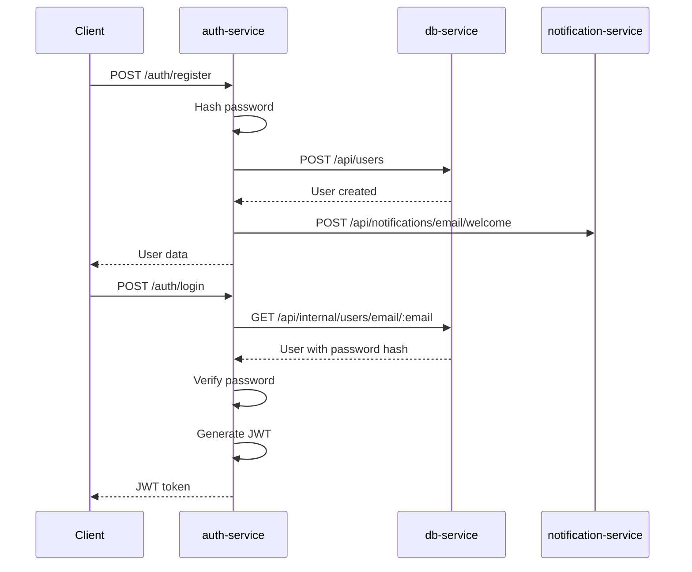
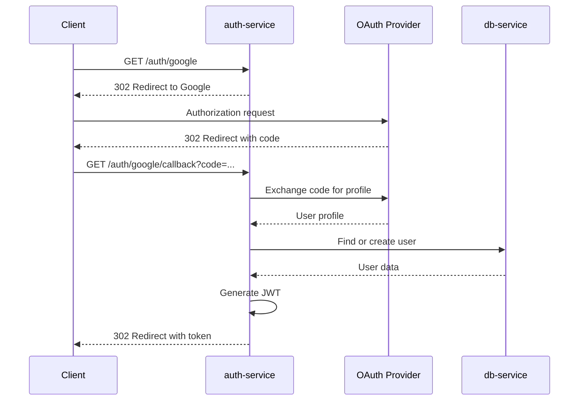

# Auth Service - SupervIA

**Service d'authentification multi-méthodes avec support OAuth et authentification locale**

## 📋 Vue d'ensemble

Le `auth-service` est responsable de toute l'authentification dans SupervIA. Il prend en charge l'authentification locale par email/mot de passe, l'OAuth avec Google et GitHub, la gestion des JWT, et l'intégration avec les services de notification pour l'accueil des nouveaux utilisateurs.

## 🏗️ Architecture

### Technologies utilisées
- **Runtime** : Node.js avec Express.js
- **Authentification locale** : bcryptjs pour le hachage des mots de passe
- **OAuth** : Passport.js avec stratégies Google et GitHub
- **JWT** : jsonwebtoken pour les tokens d'accès
- **Sessions** : express-session pour OAuth temporaire
- **Sécurité** : Helmet, CORS, Rate Limiting
- **Communication** : Axios pour les appels inter-services
- **Tests** : Jest + Supertest avec mocks Axios

### Structure des fichiers
```
src/
├── controllers/          # Logique métier
│   └── authController.js     # Gestion auth locale (register/login)
├── routes/              # Définition des routes
│   ├── authRoutes.js         # Routes auth locale + profile
│   └── oauthRoutes.js        # Routes OAuth (Google/GitHub)
├── config/              # Configuration
│   ├── passport.js           # Stratégies Passport (OAuth)
│   ├── swagger.js           # Documentation API
│   └── logger.js            # Logging avec Pino
├── middleware/          # Middlewares Express
│   ├── authenticateToken.js  # Vérification JWT
│   └── errorHandler.js       # Gestion d'erreurs centralisée
├── app.js              # Configuration Express
└── index.js            # Point d'entrée
```

## 🔐 Méthodes d'authentification

### 1. Authentification locale (Email/Mot de passe)

#### Inscription (`POST /auth/register`)
```javascript
const register = async (req, res, next) => {
  const { email, password, name } = req.body;
  
  // 1. Validation des champs requis
  if (!email || !password) {
    throw new Error('Email and password are required.');
  }
  
  // 2. Hachage sécurisé du mot de passe
  const salt = await bcrypt.genSalt(10);
  const hashedPassword = await bcrypt.hash(password, salt);
  
  // 3. Création via db-service
  const response = await axios.post(`${DB_SERVICE_URL}/api/users`, {
    email, password: hashedPassword, name
  }, internalApiConfig);
  
  // 4. Email de bienvenue (non-bloquant)
  await axios.post(`${NOTIFICATION_SERVICE_URL}/api/notifications/email/welcome`, {
    to: email, name: name || 'Nouvel utilisateur'
  }, internalApiConfig);
  
  return response.data;
};
```

**Fonctionnalités spéciales** :
- **Gestion des doublons** : Si l'email existe (409), bascule automatiquement vers le login
- **Email de bienvenue** : Envoi automatique via notification-service (non-bloquant)
- **Sécurité** : Salt unique par mot de passe, validation stricte

#### Connexion (`POST /auth/login`)
```javascript
const login = async (req, res, next) => {
  const { email, password } = req.body;
  
  // 1. Récupération du hash via endpoint interne
  const userResponse = await axios.get(
    `${DB_SERVICE_URL}/api/internal/users/email/${encodeURIComponent(email)}`, 
    internalApiConfig
  );
  const user = userResponse.data;
  
  // 2. Vérification du mot de passe
  const isMatch = await bcrypt.compare(password, user.password);
  if (!isMatch) {
    throw new Error('Invalid credentials');
  }
  
  // 3. Génération du JWT
  const payload = { id: user.id, email: user.email };
  const token = jwt.sign(payload, process.env.JWT_SECRET, { expiresIn: '1h' });
  
  return { message: 'Logged in successfully', token };
};
```

**Points clés** :
- **Endpoint interne** : Utilise `/api/internal/users/email/:email` pour récupérer le hash
- **Sécurité** : Comparaison timing-safe avec bcrypt
- **JWT** : Token signé avec expiration 1 heure

### 2. OAuth (Google & GitHub)

#### Configuration Passport.js
```javascript
// Stratégie conditionnelle (évite les erreurs en test)
const hasGoogle = Boolean(process.env.GOOGLE_CLIENT_ID && process.env.GOOGLE_CLIENT_SECRET);
if (hasGoogle) {
  passport.use(new GoogleStrategy({
    clientID: process.env.GOOGLE_CLIENT_ID,
    clientSecret: process.env.GOOGLE_CLIENT_SECRET,
    callbackURL: `${process.env.AUTH_SERVICE_URL}/auth/google/callback`,
  }, async (accessToken, refreshToken, profile, done) => {
    try {
      const user = await findOrCreateUser(profile);
      return done(null, user);
    } catch (error) {
      return done(error, null);
    }
  }));
}
```

#### Logique Find-or-Create
```javascript
const findOrCreateUser = async (profile) => {
  const email = profile.emails?.[0]?.value;
  if (!email) {
    throw new Error("Impossible d'obtenir l'adresse email du fournisseur OAuth.");
  }

  try {
    // 1. Recherche de l'utilisateur existant
    const response = await axios.get(`${DB_SERVICE_URL}/api/users/email/${email}`, internalApiConfig);
    return response.data;
  } catch (error) {
    if (error.response?.status === 404) {
      // 2. Création si inexistant
      const newUserPayload = {
        email,
        name: profile.displayName || profile.username,
        // Pas de mot de passe pour OAuth
      };
      
      const createResponse = await axios.post(`${DB_SERVICE_URL}/api/users`, newUserPayload, internalApiConfig);
      return createResponse.data;
    }
    throw error;
  }
};
```

#### Flow OAuth complet

1. **Initiation** : `GET /auth/google` → Redirection vers Google
2. **Callback** : `GET /auth/google/callback` → Traitement du code d'autorisation
3. **Find-or-Create** : Recherche ou création de l'utilisateur
4. **Token JWT** : Génération et redirection vers le frontend
5. **Callback frontend** : `/auth/callback?token=...`

### 3. Gestion des JWT

#### Middleware d'authentification
```javascript
const authenticateToken = (req, res, next) => {
  const authHeader = req.headers['authorization'];
  const token = authHeader && authHeader.split(' ')[1]; // "Bearer TOKEN"

  if (!token) {
    return res.sendStatus(401); // Unauthorized
  }

  jwt.verify(token, process.env.JWT_SECRET, (err, user) => {
    if (err) {
      return res.sendStatus(403); // Forbidden (token invalide/expiré)
    }
    req.user = user;
    next();
  });
};
```

#### Endpoint de profil
```javascript
// GET /auth/profile (protégé par JWT)
const getProfile = (req, res) => {
  res.json(req.user); // Utilisateur décodé du JWT
};
```

## 🛡️ Sécurité

### Rate Limiting
- **30 requêtes/minute** sur `/auth/*`
- Protection contre les attaques de force brute
- Headers standards (draft-7)

### Sécurisation des mots de passe
```javascript
// Génération de salt unique
const salt = await bcrypt.genSalt(10);
const hashedPassword = await bcrypt.hash(password, salt);

// Comparaison timing-safe
const isMatch = await bcrypt.compare(password, user.password);
```

### Configuration CORS
- **Origin** : `process.env.FRONTEND_URL`
- **Credentials** : `true` (pour les cookies de session OAuth)
- **Headers** : `Content-Type`, `Authorization`
- **Méthodes** : `GET`, `POST`, `OPTIONS`

### Sessions OAuth temporaires
```javascript
app.use(session({
  secret: process.env.SESSION_SECRET,
  resave: false,
  saveUninitialized: false,
  cookie: {
    secure: process.env.NODE_ENV === 'production', // HTTPS en prod
    httpOnly: true, // Protection XSS
    sameSite: 'lax', // Protection CSRF
    maxAge: 1000 * 60 * 60 // 1 heure
  }
}));
```

## 📡 Communication Inter-Services

### Avec db-service
```javascript
const internalApiConfig = {
  headers: {
    'X-Internal-Api-Key': process.env.INTERNAL_API_KEY
  }
};

// Création d'utilisateur
await axios.post(`${DB_SERVICE_URL}/api/users`, userData, internalApiConfig);

// Récupération avec hash (endpoint interne)
await axios.get(`${DB_SERVICE_URL}/api/internal/users/email/${email}`, internalApiConfig);
```

### Avec notification-service
```javascript
// Email de bienvenue (non-bloquant)
try {
  await axios.post(`${NOTIFICATION_SERVICE_URL}/api/notifications/email/welcome`, {
    to: email,
    name: name || 'Nouvel utilisateur'
  }, internalApiConfig);
  logger.info(`Email de bienvenue envoyé à ${email}`);
} catch (emailError) {
  // Ne pas faire échouer l'inscription si l'email ne peut pas être envoyé
  logger.warn({ err: emailError }, `Impossible d'envoyer l'email de bienvenue à ${email}`);
}
```

## 🧪 Tests

### Structure des tests
- **health.spec.js** : Vérification du service
- **auth.spec.js** : Tests des flows d'authentification avec mocks Axios

### Mocks Axios
```javascript
jest.mock('axios');

// Mock des réponses db-service
axios.get.mockResolvedValueOnce({ 
  data: { 
    id: 1, 
    email: 'john@example.com', 
    password: await bcrypt.hash('secret', 10) 
  } 
});

// Mock de création d'utilisateur
axios.post.mockResolvedValueOnce({ 
  data: { id: 1, email: 'john@example.com' } 
});
```

### Variables d'environnement pour tests
```javascript
// tests/setupEnv.js
process.env.JWT_SECRET = 'test-secret';
process.env.DB_SERVICE_URL = 'http://db-service:3000';
process.env.INTERNAL_API_KEY = 'test-internal-key';
// Secrets OAuth factices pour éviter les warnings
process.env.GOOGLE_CLIENT_ID = 'test-google-id';
process.env.GOOGLE_CLIENT_SECRET = 'test-google-secret';
```

## 📚 Documentation API

### Swagger UI
- **URL** : `http://localhost:3002/docs`
- **Schémas** : Bearer Auth JWT documenté
- **Endpoints** : Auth locale + OAuth avec exemples

### Endpoints disponibles

#### Authentification locale
- `POST /auth/register` - Inscription
- `POST /auth/login` - Connexion
- `GET /auth/profile` - Profil utilisateur (JWT requis)

#### OAuth
- `GET /auth/google` - Initiation OAuth Google
- `GET /auth/google/callback` - Callback OAuth Google
- `GET /auth/github` - Initiation OAuth GitHub
- `GET /auth/github/callback` - Callback OAuth GitHub

## 🚀 Déploiement

### Variables d'environnement
```env
# Services
DB_SERVICE_URL="http://db-service:3001"
NOTIFICATION_SERVICE_URL="http://notification-service:3004"
FRONTEND_URL="http://localhost:3000"
AUTH_SERVICE_URL="http://localhost:3002"

# Sécurité
JWT_SECRET="your-super-secret-jwt-key"
INTERNAL_API_KEY="your-internal-api-key"
SESSION_SECRET="your-session-secret"

# OAuth Google (optionnel)
GOOGLE_CLIENT_ID="your-google-client-id"
GOOGLE_CLIENT_SECRET="your-google-client-secret"

# OAuth GitHub (optionnel)
GITHUB_CLIENT_ID="your-github-client-id"
GITHUB_CLIENT_SECRET="your-github-client-secret"

# Configuration
PORT=3002
NODE_ENV="production"
```

### Configuration OAuth

#### Google OAuth
1. Console Google Cloud → APIs & Services → Credentials
2. Créer un "OAuth 2.0 Client ID"
3. **Authorized redirect URIs** : `http://localhost:3002/auth/google/callback`
4. Scopes : `profile`, `email`

#### GitHub OAuth
1. GitHub Settings → Developer settings → OAuth Apps
2. **Authorization callback URL** : `http://localhost:3002/auth/github/callback`
3. Scopes : `user:email`

### Docker
```dockerfile
# Multi-stage avec utilisateur non-root
FROM node:lts-alpine AS deps
RUN --mount=type=cache,target=/root/.npm npm ci

FROM node:lts-alpine
RUN addgroup -S nodeapp && adduser -S nodeapp -G nodeapp
USER nodeapp
CMD ["node", "src/index.js"]
```

## 🔄 Flux d'authentification

### Authentification locale


### OAuth Flow


## ⚠️ Points d'attention

### Sécurité
- **Secrets OAuth** : Ne jamais committer dans le code
- **JWT Secret** : Utiliser une clé forte et unique
- **Rate limiting** : Surveillance des tentatives de connexion
- **HTTPS obligatoire** : En production pour OAuth

### Gestion des erreurs
- **Credentials invalides** : Toujours retourner "Invalid credentials" (pas de détail)
- **OAuth failures** : Redirection vers `/login?error=auth_failed`
- **Services indisponibles** : Fallback gracieux

### Monitoring
- **Logs structurés** : Connexions réussies/échouées
- **Métriques** : Taux de succès par méthode d'auth
- **Alertes** : Tentatives de connexion suspectes

## 🔗 Intégrations

### Services dépendants
- **db-service** : Gestion des utilisateurs
- **notification-service** : Emails de bienvenue
- **OAuth Providers** : Google, GitHub

### Services clients
- **Frontend** : Authentification via formulaires et redirections OAuth
- **Tous les services backend** : Validation JWT pour les endpoints protégés
