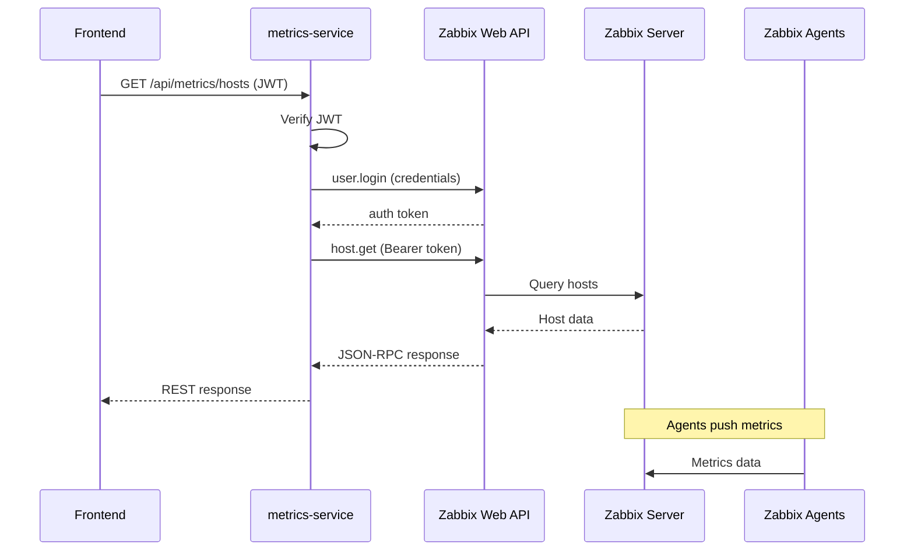
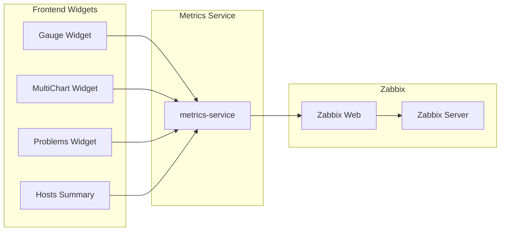

# Metrics Service - SupervIA

**Service de métriques avec intégration Zabbix pour la supervision d'infrastructure**

## 📋 Vue d'ensemble

Le `metrics-service` fait le pont entre SupervIA et Zabbix, fournissant une API REST moderne pour accéder aux données de supervision. Il encapsule l'API JSON-RPC de Zabbix et offre des endpoints optimisés pour le dashboard, avec authentification JWT et support inter-services.

## 🏗️ Architecture

### Technologies utilisées
- **Runtime** : Node.js avec Express.js
- **Intégration** : API Zabbix JSON-RPC 2.0
- **Authentification** : JWT + Clé API interne
- **Communication** : Axios pour les appels Zabbix
- **Documentation** : Swagger/OpenAPI
- **Tests** : Jest + Supertest avec mocks Axios

### Structure des fichiers
```
src/
├── controllers/          # Logique métier
│   └── zabbixController.js    # Interface avec API Zabbix
├── routes/              # Définition des routes
│   └── metricsRoutes.js      # Routes métriques et hôtes
├── middleware/          # Middlewares Express
│   ├── authenticateRequest.js # Auth JWT + clé interne
│   └── errorHandler.js        # Gestion d'erreurs centralisée
├── config/              # Configuration
│   ├── swagger.js            # Documentation API
│   └── logger.js            # Logging avec Pino
├── app.js              # Configuration Express
└── index.js            # Point d'entrée
```

## 🔌 Intégration Zabbix

### Classe ZabbixAPI

```javascript
class ZabbixAPI {
    constructor() {
        this.auth = null;        // Token d'authentification Zabbix
        this.requestId = 1;      // ID séquentiel pour JSON-RPC
    }

    async login() {
        const response = await axios.post(process.env.ZABBIX_URL, {
            jsonrpc: '2.0',
            method: 'user.login',
            params: {
                username: process.env.ZABBIX_USER,
                password: process.env.ZABBIX_PASSWORD
            },
            id: this.requestId++
        });
        
        this.auth = response.data.result;
        return this.auth;
    }

    async request(method, params = {}) {
        if (!this.auth) {
            await this.login();
        }

        const response = await axios.post(process.env.ZABBIX_URL, {
            jsonrpc: '2.0',
            method: method,
            params: params,
            id: this.requestId++
        }, {
            headers: {
                'Authorization': `Bearer ${this.auth}`
            }
        });

        return response.data.result;
    }
}
```

**Fonctionnalités** :
- **Auto-login** : Connexion automatique si le token n'existe pas
- **Bearer token** : Authentification via en-tête HTTP
- **Gestion d'erreurs** : Parsing des erreurs JSON-RPC
- **Instance singleton** : Une seule instance partagée

### Configuration Zabbix

#### Variables d'environnement
```env
ZABBIX_URL="http://zabbix-web:8080/api_jsonrpc.php"
ZABBIX_USER="Admin"
ZABBIX_PASSWORD="zabbix"
```

#### Intégration Docker
```yaml
metrics-service:
  depends_on:
    - zabbix-web  # Interface web Zabbix pour l'API
```

Le service communique avec l'interface web Zabbix sur le port 8080 du container `zabbix-web`.

## 📊 Endpoints de métriques

### 🏠 Gestion des hôtes

#### `GET /api/metrics/hosts`
Récupère tous les hôtes supervisés par Zabbix
```javascript
const getZabbixHosts = async (req, res, next) => {
    const hosts = await zabbixAPI.request('host.get', {
        output: 'extend',           // Tous les champs
        selectInterfaces: 'extend', // Interfaces réseau
        selectInventory: 'extend',  // Informations d'inventaire
        selectTags: 'extend',       // Tags Zabbix
        selectGroups: 'extend',     // Groupes d'hôtes
    });
    
    res.json(hosts);
};
```

**Réponse** :
```json
[
  {
    "hostid": "10084",
    "host": "Docker Host",
    "name": "Docker Host",
    "status": "0",           // 0 = enabled, 1 = disabled
    "available": "1",        // 1 = available, 0 = unavailable
    "interfaces": [...],
    "groups": [...],
    "inventory": {...}
  }
]
```

#### `GET /api/metrics/hosts/summary`
Statistiques rapides des hôtes
```javascript
const getHostsSummary = async (req, res, next) => {
    const hosts = await zabbixAPI.request('host.get', {
        output: ['hostid', 'name', 'status', 'available', 'snmp_available', 'jmx_available', 'ipmi_available'],
    });

    const total = hosts.length;
    const online = hosts.filter((h) => {
        const enabled = h.status === '0';
        const anyAvailable = (h.available === '1') || (h.snmp_available === '1') || 
                           (h.jmx_available === '1') || (h.ipmi_available === '1');
        return enabled && anyAvailable;
    }).length;
    const offline = Math.max(0, total - online);

    res.json({ total, online, offline, updatedAt: new Date().toISOString() });
};
```

**Usage** : Widgets de tableau de bord pour affichage rapide.

### 📈 Métriques et Items

#### `GET /api/metrics/items/:hostid`
Récupère toutes les métriques d'un hôte
```javascript
const getZabbixItemsForHost = async (req, res, next) => {
    const { hostid } = req.params;
    
    const items = await zabbixAPI.request('item.get', {
        output: 'extend',    // Tous les champs de l'item
        hostids: hostid,
        sortfield: 'name'
    });
    
    res.json(items);
};
```

**Réponse** :
```json
[
  {
    "itemid": "23254",
    "name": "CPU utilization",
    "key_": "system.cpu.util",
    "value_type": "0",      // 0=float, 3=unsigned, 1=character, etc.
    "units": "%",
    "status": "0",          // 0=enabled
    "lastvalue": "15.2",
    "lastclock": "1640995200"
  }
]
```

#### `GET /api/metrics/items/:hostid/top?limit=5`
Top N des métriques numériques par valeur
```javascript
const getTopItemsForHost = async (req, res, next) => {
    const { hostid } = req.params;
    const limit = Math.max(1, Math.min(parseInt(req.query.limit || '5', 10), 20));
    
    const items = await zabbixAPI.request('item.get', {
        output: ['itemid', 'hostid', 'name', 'key_', 'lastvalue', 'units', 'lastclock', 'value_type'],
        hostids: hostid,
        sortfield: 'name',
    });

    const numeric = items
        .filter((it) => it.lastvalue !== undefined && !isNaN(Number(it.lastvalue)))
        .sort((a, b) => Number(b.lastvalue) - Number(a.lastvalue))
        .slice(0, limit);

    res.json(numeric);
};
```

**Usage** : Suggestions de widgets basées sur les métriques les plus élevées.

### 📊 Données historiques

#### `GET /api/metrics/history/:itemid?from=&to=&limit=500`
Récupère l'historique temporel d'une métrique
```javascript
const getItemHistory = async (req, res, next) => {
    const { itemid } = req.params;
    const { from, to, limit } = req.query;
    
    // 1. Déterminer le type d'historique via l'item
    const items = await zabbixAPI.request('item.get', {
        output: ['itemid', 'value_type'],
        itemids: [itemid],
    });
    
    if (!items || items.length === 0) {
        return res.status(404).json({ message: "Item introuvable" });
    }
    
    const valueType = items[0].value_type;
    const numericTypes = ['0', '3'];  // float, unsigned
    const historyType = numericTypes.includes(String(valueType)) ? Number(valueType) : 0;
    
    // 2. Récupérer l'historique
    const time_from = from ? Number(from) : Math.floor(Date.now() / 1000) - 3600; // 1h par défaut
    const time_till = to ? Number(to) : Math.floor(Date.now() / 1000);
    const max = Math.min(Number(limit || 500), 2000);

    const history = await zabbixAPI.request('history.get', {
        output: 'extend',
        history: historyType,
        itemids: [itemid],
        time_from,
        time_till,
        sortfield: 'clock',
        sortorder: 'ASC',
        limit: max,
    });

    // 3. Normaliser la réponse
    const normalized = (history || []).map((h) => ({
        clock: String(h.clock),    // Timestamp epoch
        value: String(h.value),    // Valeur métrique
    }));
    
    res.json(normalized);
};
```

**Types d'historique Zabbix** :
- `0` : Numeric float
- `1` : Character 
- `2` : Log
- `3` : Numeric unsigned
- `4` : Text

**Usage** : Graphiques temporels dans les widgets multiChart.

### ⚠️ Problèmes et alertes

#### `GET /api/metrics/problems`
Récupère les problèmes actifs
```javascript
const getZabbixProblems = async (req, res, next) => {
    const problems = await zabbixAPI.request('problem.get', {
        output: 'extend',
        selectAcknowledges: 'extend',   // Acquittements
        selectTags: 'extend',           // Tags du problème
        recent: true,                   // Problèmes récents uniquement
        sortfield: ['eventid'],
        sortorder: 'DESC'
    });
    
    res.json(problems);
};
```

**Réponse** :
```json
[
  {
    "eventid": "1234",
    "objectid": "13456",      // ID du trigger
    "name": "High CPU usage on Docker Host",
    "severity": "4",          // 0=not classified, 1=info, 2=warning, 3=average, 4=high, 5=disaster
    "clock": "1640995200",
    "r_clock": "0",          // 0 = non résolu
    "acknowledged": "0",      // 0 = non acquitté
    "tags": [...]
  }
]
```

**Usage** : Widget "Problèmes" pour supervision centralisée.

## 🔒 Authentification

### Double authentification
```javascript
const authenticateRequest = (req, res, next) => {
  const authHeader = req.headers['authorization'];
  const internalApiKey = req.headers['x-internal-api-key'];

  // Cas 1: Service-to-service
  if (internalApiKey) {
    if (internalApiKey === process.env.INTERNAL_API_KEY) {
      req.user = { id: 'internal-service', roles: ['service'] };
      return next();
    } else {
      return res.sendStatus(401);
    }
  }

  // Cas 2: Authentification utilisateur
  const token = authHeader && authHeader.split(' ')[1];
  if (!token) {
    return res.sendStatus(401);
  }

  jwt.verify(token, process.env.JWT_SECRET, (err, user) => {
    if (err) {
      return res.sendStatus(403);
    }
    req.user = user;
    next();
  });
};
```

### Méthodes supportées
1. **JWT Bearer** : `Authorization: Bearer <token>` (utilisateurs)
2. **Clé interne** : `X-Internal-Api-Key: <key>` (services)

## 🧪 Tests

### Structure des tests
```javascript
// tests/metrics.spec.js
describe('metrics-service endpoints', () => {
  beforeEach(() => {
    jest.resetAllMocks();
  });

  it('GET /api/metrics/hosts -> 401 without auth', async () => {
    const res = await request(app).get('/api/metrics/hosts');
    expect(res.status).toBe(401);
  });

  it('GET /api/metrics/hosts -> 200 with JWT (axios mocked)', async () => {
    // Mock de la séquence login + host.get
    axios.post.mockImplementation((url, body) => {
      if (body && body.method === 'user.login') {
        return Promise.resolve({ data: { result: 'auth-token' } });
      }
      if (body && body.method === 'host.get') {
        return Promise.resolve({ data: { result: [
          { hostid: '1', name: 'Host-1', status: '0' }
        ]}});
      }
      return Promise.resolve({ data: { result: [] } });
    });

    const token = signToken();
    const res = await request(app)
      .get('/api/metrics/hosts')
      .set('Authorization', `Bearer ${token}`);
    expect(res.status).toBe(200);
    expect(Array.isArray(res.body)).toBe(true);
  });
});
```

### Mock Zabbix API
```javascript
// Mock complet de l'API Zabbix
axios.post.mockImplementation((url, body) => {
  if (body?.method === 'user.login') {
    return Promise.resolve({ data: { result: 'mock-auth-token' } });
  }
  if (body?.method === 'host.get') {
    return Promise.resolve({ data: { result: mockHosts } });
  }
  if (body?.method === 'item.get') {
    return Promise.resolve({ data: { result: mockItems } });
  }
  if (body?.method === 'problem.get') {
    return Promise.resolve({ data: { result: mockProblems } });
  }
  return Promise.resolve({ data: { result: [] } });
});
```

## 📚 Documentation API

### Swagger UI
- **URL** : `http://localhost:3003/docs`
- **Authentification** : Bearer Auth JWT documenté
- **Endpoints** : Tous les endpoints avec exemples de réponse

### Types de données

#### ZabbixHost
```typescript
interface ZabbixHost {
  hostid: string;
  host: string;        // Nom technique
  name: string;        // Nom d'affichage
  status: string;      // "0" = enabled, "1" = disabled
  available: string;   // "1" = available, "0" = unavailable
  interfaces?: ZabbixInterface[];
  groups?: ZabbixGroup[];
  inventory?: object;
}
```

#### ZabbixItem
```typescript
interface ZabbixItem {
  itemid: string;
  hostid: string;
  name: string;        // Nom d'affichage
  key_: string;        // Clé technique Zabbix
  value_type: string;  // "0"=float, "1"=char, "3"=unsigned, etc.
  units: string;       // "%", "B", "bps", etc.
  status: string;      // "0" = enabled
  lastvalue?: string;  // Dernière valeur
  lastclock?: string;  // Timestamp dernière collecte
}
```

#### HistoryPoint
```typescript
interface HistoryPoint {
  clock: string;       // Timestamp epoch (seconds)
  value: string;       // Valeur métrique
}
```

## 🚀 Déploiement

### Variables d'environnement
```env
# Connexion Zabbix
ZABBIX_URL="http://zabbix-web:8080/api_jsonrpc.php"
ZABBIX_USER="Admin"
ZABBIX_PASSWORD="zabbix"

# Authentification SupervIA
JWT_SECRET="your-jwt-secret"
INTERNAL_API_KEY="your-internal-api-key"

# Configuration service
PORT=3003
FRONTEND_URL="http://localhost:3000"
```

### Intégration avec Zabbix

#### Configuration manuelle requise
Voir [`ZABBIX_MANUAL_SETUP.md`](../../ZABBIX_MANUAL_SETUP.md) :
1. **Auto-registration** : Configuration des actions Zabbix
2. **Templates** : Application automatique aux nouveaux hôtes
3. **Agents** : Déploiement sur chaque service SupervIA

#### Agents Zabbix intégrés
Chaque service SupervIA dispose de son agent Zabbix :
```yaml
# docker-compose.yml
metrics-service-zabbix-agent:
  image: zabbix/zabbix-agent:latest
  environment:
    ZBX_SERVER_HOST: "zabbix-server"
    ZBX_HOSTNAME: "Metrics Service"
```

### Rate Limiting
```javascript
const metricsLimiter = rateLimit({
  windowMs: 60 * 1000,   // 1 minute
  limit: 60,             // 60 requêtes max
  standardHeaders: 'draft-7',
  legacyHeaders: false,
});
app.use('/api/metrics', metricsLimiter);
```

## 🔄 Flux d'intégration

### Communication avec Zabbix


### Intégration dashboard


## ⚠️ Points d'attention

### Performance
- **Cache Zabbix** : Token d'auth réutilisé entre requêtes
- **Rate limiting** : 60 req/min pour éviter la surcharge
- **Pagination** : Limite max 2000 points d'historique
- **Filtrage** : Types de valeurs optimisés (numeric uniquement pour top items)

### Fiabilité
- **Auto-reconnexion** : Login automatique si token expiré
- **Gestion d'erreurs** : Parsing des erreurs JSON-RPC Zabbix
- **Validation** : Vérification des IDs d'hôtes/items
- **Logs structurés** : Debug facile des problèmes d'intégration

### Sécurité
- **Credentials Zabbix** : Stockage en variables d'environnement
- **Authentification double** : JWT utilisateur + clé interne services
- **Logs sécurisés** : Mot de passe Zabbix jamais loggé

### Monitoring
- **Health check** : `/health` pour orchestrateurs
- **Métriques disponibles** : Le service lui-même est monitoré par Zabbix
- **Logs structurés** : Pino avec niveaux appropriés

## 🔗 Intégrations

### Services dépendants
- **Zabbix Web** : API JSON-RPC pour toutes les données
- **Zabbix Server** : Source des métriques et alertes
- **Auth-service** : Validation des JWT utilisateurs

### Services clients
- **Frontend** : Widgets de dashboard consommant l'API REST
- **AI-service** : Analyse des métriques pour suggestions de seuils
- **Notification-service** : Potentielle intégration future pour alertes Zabbix

### Métriques exposées
Le `metrics-service` expose lui-même des métriques via son agent Zabbix :
- CPU, mémoire, réseau du container
- Métriques applicatives Node.js
- Temps de réponse API Zabbix
- Taux d'erreur des requêtes
