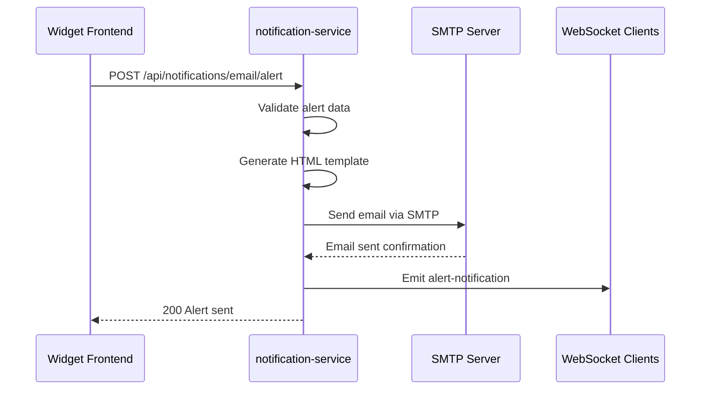
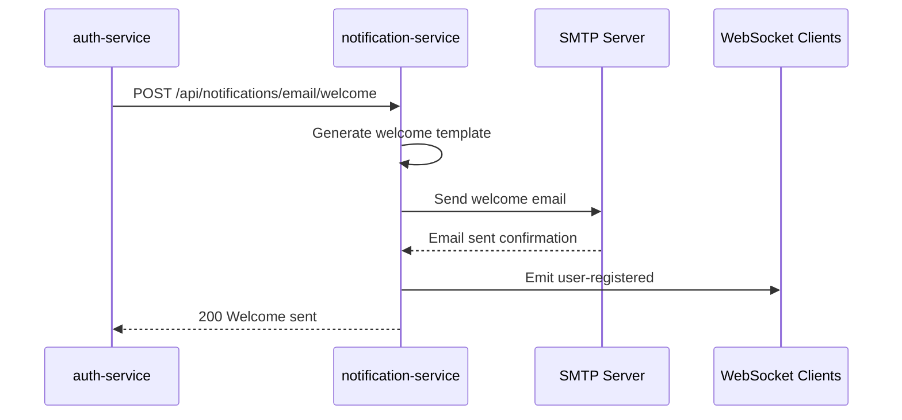

# Notification Service - SupervIA

**Service de notifications hybride : emails SMTP et notifications temps-réel via WebSocket**

## 📋 Vue d'ensemble

Le `notification-service` gère toute la communication sortante de SupervIA. Il combine l'envoi d'emails via SMTP (alertes, bienvenue) et les notifications temps-réel via WebSocket (événements système, alertes critiques). Le service offre des templates d'emails enrichis et un système d'événements temps-réel pour une expérience utilisateur moderne.

## 🏗️ Architecture

### Technologies utilisées
- **Runtime** : Node.js avec Express.js
- **Email** : Nodemailer avec support SMTP
- **WebSocket** : Socket.io pour temps-réel
- **Templates** : HTML inline avec CSS responsive
- **Authentification** : JWT + Clé API interne
- **Tests** : Jest + Supertest + Socket.io-client

### Structure des fichiers
```
src/
├── controllers/          # Logique métier
│   └── notificationController.js # Gestion emails et alertes
├── services/            # Services externes
│   └── emailService.js        # Interface Nodemailer
├── routes/              # Définition des routes
│   └── notificationRoutes.js  # Routes REST pour notifications
├── middleware/          # Middlewares Express
│   ├── authenticateToken.js   # Auth JWT + clé interne
│   └── errorHandler.js        # Gestion d'erreurs centralisée
├── config/              # Configuration
│   ├── swagger.js            # Documentation API
│   └── logger.js            # Logging avec Pino
├── app.js              # Configuration Express
└── index.js            # Point d'entrée + Socket.io
```

## 📧 Service d'Email

### Configuration Nodemailer

```javascript
const transporter = nodemailer.createTransporter({
  host: process.env.SMTP_HOST,        // Ex: smtp.mailtrap.io
  port: parseInt(process.env.SMTP_PORT || "587", 10),
  secure: process.env.SMTP_SECURE === 'true',  // TLS
  auth: {
    user: process.env.SMTP_USER,
    pass: process.env.SMTP_PASS,
  },
});

// Vérification de configuration au démarrage
if (process.env.NODE_ENV !== 'test') {
  transporter.verify((error, success) => {
    if (error) {
      logger.fatal(error, 'La configuration SMTP est invalide.');
    } else {
      logger.info('Le service de messagerie est prêt à envoyer des emails.');
    }
  });
}
```

### Fonction d'envoi sécurisée

```javascript
const sendEmail = async ({ to, subject, text, html }) => {
  const mailOptions = {
    from: `"${process.env.SMTP_FROM_NAME}" <${process.env.SMTP_FROM_EMAIL}>`,
    to,
    subject,
    text,
    html,
  };

  try {
    const info = await transporter.sendMail(mailOptions);
    logger.info({ 
      msg: `Email envoyé à ${to}`, 
      messageId: info.messageId, 
      preview: nodemailer.getTestMessageUrl(info)  // Mailtrap preview
    });
    return info;
  } catch (error) {
    logger.error(error, `Échec de l'envoi de l'email à ${to}`);
    // Sécurité: ne pas exposer les détails SMTP
    throw new Error('Le serveur de messagerie a rencontré une erreur.');
  }
};
```

## 📨 Types d'emails

### 1. Email générique (`POST /api/notifications/email/send`)

```javascript
const sendTestEmail = async (req, res, next) => {
  const { to, subject, text, html } = req.body;
  
  // Fallback vers destinataire par défaut
  const defaultTo = process.env.NOTIF_DEFAULT_TO || '';
  const resolvedTo = (to && String(to).trim().length > 0) ? to : defaultTo;
  
  // Template HTML par défaut si non fourni
  const fallbackHtml = html || generateDefaultTemplate(subject, text);
  
  await sendEmail({ to: resolvedTo, subject, text, html: fallbackHtml });
  res.status(200).json({ message: 'Email envoyé avec succès.' });
};
```

**Fonctionnalités** :
- **Destinataire par défaut** : `NOTIF_DEFAULT_TO` si `to` non fourni
- **Template automatique** : HTML généré si non fourni
- **CSS inline** : Compatible tous clients email

### 2. Email d'alerte enrichi (`POST /api/notifications/email/alert`)

```javascript
const sendAlertEmail = async (req, res, next) => {
  const { 
    alertType,        // 'gauge', 'multiChart', 'availability', 'problems', 'metricValue'
    severity = 'warning',  // 'critical', 'high', 'medium', 'warning', 'info'
    widgetTitle,
    hostName,
    metricName,
    currentValue,
    threshold,
    units = '',
    condition,
    timestamp,
    dashboardUrl,
    additionalContext = {}
  } = req.body;
  
  // Fonction de mapping sévérité → visuel
  const getSeverityInfo = (sev) => {
    switch (sev.toLowerCase()) {
      case 'critical': return { icon: '🚨', color: '#dc2626', label: 'CRITIQUE' };
      case 'high': return { icon: '⚠️', color: '#ea580c', label: 'ÉLEVÉE' };
      case 'medium': return { icon: '⚡', color: '#d97706', label: 'MOYENNE' };
      case 'warning': return { icon: '⚠️', color: '#ca8a04', label: 'ATTENTION' };
      case 'info': return { icon: 'ℹ️', color: '#2563eb', label: 'INFO' };
      default: return { icon: '⚠️', color: '#6b7280', label: 'ALERTE' };
    }
  };

  const severityInfo = getSeverityInfo(severity);
  
  // Construction du sujet enrichi
  const subject = `${severityInfo.icon} [${severityInfo.label}] ${widgetTitle} - ${hostName}`;
  
  // Template HTML professionnel avec gradient et responsive design
  const html = generateAlertTemplate({
    severityInfo,
    widgetTitle,
    hostName,
    metricName,
    currentValue,
    threshold,
    units,
    condition,
    timestamp,
    dashboardUrl,
    additionalContext
  });
};
```

#### Template d'alerte HTML

```html
<!DOCTYPE html>
<html>
<head>
  <meta charset="utf-8">
  <title>Alerte SupervIA - ${severityInfo.label}</title>
  <style>
    body { 
      font-family: -apple-system, BlinkMacSystemFont, 'Segoe UI', Roboto, sans-serif; 
      line-height: 1.6; 
      color: #1f2937; 
      background: #f9fafb; 
      margin: 0; 
      padding: 20px; 
    }
    .container { 
      max-width: 600px; 
      margin: 0 auto; 
      background: white; 
      border-radius: 12px; 
      overflow: hidden; 
      box-shadow: 0 4px 6px -1px rgba(0, 0, 0, 0.1); 
    }
    .header { 
      background: linear-gradient(135deg, ${severityInfo.color}, ${severityInfo.color}dd); 
      color: white; 
      padding: 24px; 
      text-align: center; 
    }
    .alert-details { 
      background: #f8fafc; 
      border-left: 4px solid ${severityInfo.color}; 
      padding: 16px; 
      margin: 16px 0; 
      border-radius: 0 8px 8px 0; 
    }
    .detail-row { 
      display: flex; 
      justify-content: space-between; 
      padding: 8px 0; 
      border-bottom: 1px solid #e5e7eb; 
    }
    .context-section { 
      margin-top: 20px; 
      padding: 16px; 
      background: #fef3c7; 
      border-radius: 8px; 
      border: 1px solid #fbbf24; 
    }
  </style>
</head>
<body>
  <div class="container">
    <div class="header">
      <h1>${severityInfo.icon} Alerte SupervIA</h1>
      <div class="severity-badge">${severityInfo.label}</div>
    </div>
    
    <div class="content">
      <div class="alert-details">
        <div class="detail-row">
          <span class="detail-label">📊 Widget</span>
          <span class="detail-value">${widgetTitle}</span>
        </div>
        <div class="detail-row">
          <span class="detail-label">🖥️ Hôte</span>
          <span class="detail-value">${hostName}</span>
        </div>
        <!-- ... autres détails ... -->
      </div>
      
      <!-- Contexte additionnel -->
      <div class="context-section">
        <div class="context-title">📋 Informations complémentaires</div>
        <ul>
          <li>Tendance: ${additionalContext.trend}</li>
          <li>Durée: ${additionalContext.duration}</li>
          <li>Fréquence: ${additionalContext.frequency}</li>
        </ul>
      </div>
      
      <a href="${dashboardUrl}" class="action-button">🔗 Voir le dashboard</a>
    </div>
  </div>
</body>
</html>
```

### 3. Système de batch d'alertes ⭐ **NOUVEAU v1.2.0**

Le système de batch collecte automatiquement les alertes pendant 30 secondes et les envoie en un seul email récapitulatif professionnel. Cela évite le spam d'emails lors de déclenchements multiples.

#### 3.1. Ajouter une alerte au batch (`POST /api/notifications/batch/alert`)

```javascript
const sendBatchAlert = async (req, res, next) => {
  const { 
    alertType,        // 'gauge', 'multiChart', 'availability', 'problems', 'metricValue'
    severity = 'warning',  // 'critical', 'high', 'medium', 'warning', 'info'
    widgetTitle,
    hostName,
    metricName,
    currentValue,
    threshold,
    units = '',
    condition,
    additionalContext = {}
  } = req.body;

  // Ajoute l'alerte au service de batch
  alertBatchService.addAlert({
    alertType, severity, widgetTitle, hostName,
    metricName, currentValue, threshold, units, condition, additionalContext
  });

  // Émet une notification temps-réel immédiate
  io.emit('alert-notification', { 
    type: alertType, severity, widgetTitle, hostName, metricName,
    currentValue, threshold, units, timestamp: new Date().toLocaleString('fr-FR')
  });

  res.status(200).json({ 
    message: 'Alerte ajoutée au batch avec succès.',
    batchInfo: {
      alertsInBatch: alertBatchService.alerts.length,
      batchDuration: alertBatchService.batchDuration
    }
  });
};
```

**Fonctionnalités** :
- **⏱️ Collecte automatique** : 30 secondes de regroupement (configurable via `ALERT_BATCH_DURATION`)
- **📊 Regroupement intelligent** : Tri par sévérité (critical > high > medium > warning > info)
- **🎨 Email professionnel** : Template HTML avec statistiques et sections colorées
- **⚡ Notifications temps-réel** : WebSocket immédiat + email groupé
- **🔄 Gestion robuste** : Timer automatique, gestion d'erreurs, logging détaillé

#### 3.2. Forcer l'envoi du batch (`POST /api/notifications/batch/flush`)

```javascript
const flushAlertBatch = async (req, res, next) => {
  const alertCount = alertBatchService.alerts.length;
  
  if (alertCount === 0) {
    return res.status(200).json({ message: 'Aucune alerte en attente dans le batch.' });
  }

  await alertBatchService.flushBatch();
  
  res.status(200).json({ 
    message: `Batch de ${alertCount} alerte(s) envoyé avec succès.` 
  });
};
```

**Cas d'usage** :
- **🧪 Tests** : Validation du système de batch
- **⚙️ Administration** : Monitoring et debugging
- **🚨 Urgence** : Envoi immédiat sans attendre le timer

### 4. Email de bienvenue (`POST /api/notifications/email/welcome`)

```javascript
const sendWelcomeEmail = async (req, res, next) => {
  const { to, name } = req.body;
  
  const userName = name || 'Nouvel utilisateur';
  const subject = 'Bienvenue sur SupervIA - Confirmation d\'inscription';
  
  const html = `
  <!DOCTYPE html>
  <html>
  <head>
    <style>
      body { font-family: Arial, sans-serif; line-height: 1.6; color: #333; }
      .header { background-color: #2563eb; color: white; padding: 20px; text-align: center; }
      .features { background-color: #f8fafc; padding: 15px; border-radius: 5px; margin: 20px 0; }
    </style>
  </head>
  <body>
    <div class="header">
      <h1>Bienvenue sur SupervIA</h1>
    </div>
    <div class="content">
      <p>Bonjour <strong>${userName}</strong>,</p>
      <p>Votre inscription a été effectuée avec succès !</p>
      
      <div class="features">
        <h3>Fonctionnalités disponibles :</h3>
        <ul>
          <li>Dashboards personnalisables avec drag & drop</li>
          <li>Surveillance et métriques via Zabbix</li>
          <li>Intelligence artificielle intégrée</li>
          <li>Recherche avancée</li>
          <li>Export PDF de vos rapports</li>
          <li>Notifications temps réel</li>
        </ul>
      </div>
    </div>
  </body>
  </html>`;
  
  await sendEmail({ to, subject, text: generateTextVersion(userName), html });
};
```

## 🔗 WebSocket en temps-réel

### Configuration Socket.io

```javascript
// index.js
const io = new Server(server, {
  cors: {
    origin: process.env.FRONTEND_URL || "http://localhost:3000",
    methods: ["GET", "POST"]
  }
});

// Middleware d'authentification optionnelle
io.use((socket, next) => {
  try {
    const authHeader = socket.handshake.headers['authorization'];
    if (!authHeader) return next(); // Connexion publique autorisée
    
    const token = authHeader.split(' ')[1];
    if (!token) return next();
    
    const jwt = require('jsonwebtoken');
    const decoded = jwt.verify(token, process.env.JWT_SECRET);
    socket.data.user = decoded;
    next();
  } catch (e) { 
    next(); // Échec JWT non bloquant
  }
});

// Gestion des connexions
io.on('connection', (socket) => {
  logger.info(`Un utilisateur s'est connecté via socket: ${socket.id}`);
  
  socket.on('disconnect', () => {
    logger.info(`L'utilisateur s'est déconnecté: ${socket.id}`);
  });

  socket.on('joinRoom', (room) => {
    socket.join(room);
    logger.info(`Socket ${socket.id} a rejoint la room ${room}`);
  });
});
```

### Émission d'événements

#### Depuis les controllers
```javascript
// Dans sendAlertEmail()
const io = req.app.get('io');
io.emit('alert-notification', { 
  type: alertType,
  severity,
  widgetTitle,
  hostName,
  metricName,
  currentValue,
  threshold,
  units,
  timestamp: formattedTimestamp,
  subject
});

// Dans sendWelcomeEmail()
io.emit('user-registered', { 
  message: `Nouvel utilisateur inscrit: ${userName}`,
  email: to,
  timestamp: new Date()
});
```

#### Types d'événements WebSocket

1. **alert-notification** : Alertes critiques en temps-réel
   ```json
   {
     "type": "gauge",
     "severity": "critical",
     "widgetTitle": "CPU Usage Monitor",
     "hostName": "Docker Host",
     "metricName": "CPU utilization",
     "currentValue": "95.2",
     "threshold": "90",
     "units": "%",
     "timestamp": "15/01/2024 10:30:00",
     "subject": "🚨 [CRITIQUE] CPU Usage Monitor - Docker Host"
   }
   ```

2. **user-registered** : Nouveaux utilisateurs
   ```json
   {
     "message": "Nouvel utilisateur inscrit: John Doe",
     "email": "john@example.com",
     "timestamp": "2024-01-15T10:30:00.000Z"
   }
   ```

## 🔒 Authentification

### Double authentification REST
```javascript
const authenticateRequest = (req, res, next) => {
  const authHeader = req.headers['authorization'];
  const internalApiKey = req.headers['x-internal-api-key'];

  // Cas 1: Service-to-service
  if (internalApiKey) {
    if (internalApiKey === process.env.INTERNAL_API_KEY) {
      req.user = { id: 'internal-service', roles: ['service'] };
      return next();
    } else {
      return res.sendStatus(401);
    }
  }

  // Cas 2: Authentification utilisateur
  const token = authHeader && authHeader.split(' ')[1];
  if (!token) {
    return res.sendStatus(401);
  }

  jwt.verify(token, process.env.JWT_SECRET, (err, user) => {
    if (err) {
      return res.sendStatus(403);
    }
    req.user = user;
    next();
  });
};
```

### WebSocket avec JWT optionnel
- **Connexion publique** : Autorisée pour écouter les événements
- **JWT fourni** : Stockage dans `socket.data.user` pour permissions avancées
- **Rooms** : Support des salles pour notifications ciblées

## 🛡️ Sécurité

### Configuration CORS avancée
```javascript
const corsOptions = {
  origin: process.env.FRONTEND_URL || 'http://localhost:3000',
  credentials: true,
  methods: ['GET', 'POST', 'OPTIONS'],
  allowedHeaders: ['Content-Type', 'Authorization', 'X-Requested-With', 'X-Internal-Api-Key'],
  preflightContinue: false,
  optionsSuccessStatus: 204,
};
app.use(cors(corsOptions));
```

### Rate Limiting
```javascript
const notifLimiter = rateLimit({
  windowMs: 60 * 1000,    // 1 minute
  limit: 20,              // 20 emails max par minute
  standardHeaders: 'draft-7',
  legacyHeaders: false,
});
app.use('/api/notifications', notifLimiter);
```

### Sécurisation des emails
- **Validation des entrées** : Sanitisation des champs HTML
- **Templates sécurisés** : Échappement des variables utilisateur
- **Erreurs masquées** : Détails SMTP non exposés aux clients
- **Logs sécurisés** : Mots de passe SMTP jamais loggés

## 🧪 Tests

### Tests REST avec mocks
```javascript
// Mock du service email
jest.mock('../src/services/emailService', () => ({
  sendEmail: jest.fn().mockResolvedValue({ messageId: 'test' }),
}));

describe('notification-service notifications', () => {
  it('POST /api/notifications/email/send -> 200 with valid JWT', async () => {
    const token = signToken();
    const res = await request(app)
      .post('/api/notifications/email/send')
      .set('Authorization', `Bearer ${token}`)
      .send({ to: 'test@example.com', subject: 'Test', text: 'Hello' });
    expect(res.status).toBe(200);
  });

  it('POST /api/notifications/email/alert -> 200 with complete data', async () => {
    const alertData = {
      alertType: 'gauge',
      severity: 'critical',
      widgetTitle: 'CPU Usage Monitor',
      hostName: 'Docker Host',
      metricName: 'CPU utilization',
      currentValue: '95.2',
      threshold: '90',
      units: '%'
    };

    const token = signToken();
    const res = await request(app)
      .post('/api/notifications/email/alert')
      .set('Authorization', `Bearer ${token}`)
      .send(alertData);
    
    expect(res.status).toBe(200);
    expect(res.body.message).toBe('Alerte envoyée avec succès.');
  });
});
```

### Tests WebSocket
```javascript
const Client = require('socket.io-client');

describe('notification-service socket.io', () => {
  it('should emit alert-notification event', (done) => {
    const client = Client(`http://localhost:${port}`);
    
    client.on('connect', () => {
      client.on('alert-notification', (data) => {
        expect(data).toHaveProperty('type');
        expect(data).toHaveProperty('severity');
        expect(data).toHaveProperty('widgetTitle');
        client.close();
        done();
      });

      // Simuler émission d'alerte
      ioServer.emit('alert-notification', {
        type: 'gauge',
        severity: 'critical',
        widgetTitle: 'CPU Usage Monitor',
        // ...
      });
    });
  });
});
```

## 📚 Documentation API

### Swagger UI
- **URL** : `http://localhost:3004/docs`
- **Authentification** : Bearer Auth JWT documenté
- **Endpoints** : Tous les endpoints avec exemples complets

### Endpoints disponibles

#### Emails
- `POST /api/notifications/email/send` - Email générique
- `POST /api/notifications/email/alert` - Alerte enrichie (envoi direct)
- `POST /api/notifications/email/welcome` - Email de bienvenue

#### Alertes par batch ⭐ **NOUVEAU v1.2.0**
- `POST /api/notifications/batch/alert` - Ajouter alerte au batch (RECOMMANDÉ)
- `POST /api/notifications/batch/flush` - Forcer envoi immédiat du batch

#### WebSocket
- **Connexion** : `ws://localhost:3004`
- **Événements** : `alert-notification`, `user-registered`
- **Rooms** : Support via `joinRoom(roomName)`

## 🚀 Déploiement

### Variables d'environnement
```env
# Configuration SMTP
SMTP_HOST="smtp.mailtrap.io"
SMTP_PORT="587"
SMTP_SECURE="false"  # true pour port 465
SMTP_USER="your-mailtrap-user"
SMTP_PASS="your-mailtrap-password"
SMTP_FROM_NAME="SupervIA"
SMTP_FROM_EMAIL="no-reply@supervia.local"

# Destinataire par défaut
NOTIF_DEFAULT_TO="admin@supervia.local"

# Configuration du système de batch (v1.2.0)
ALERT_BATCH_DURATION="30000"  # Durée en ms (30 secondes par défaut)

# Authentification SupervIA
JWT_SECRET="your-jwt-secret"
INTERNAL_API_KEY="your-internal-api-key"

# Configuration service
PORT=3004
FRONTEND_URL="http://localhost:3000"
```

### Configuration SMTP

#### Mailtrap (Développement)
```env
SMTP_HOST="sandbox.smtp.mailtrap.io"
SMTP_PORT="2525"
SMTP_USER="your-mailtrap-username"
SMTP_PASS="your-mailtrap-password"
```

#### Gmail (Production)
```env
SMTP_HOST="smtp.gmail.com"
SMTP_PORT="587"
SMTP_USER="your-gmail@gmail.com"
SMTP_PASS="your-app-password"  # Mot de passe d'application
```

#### SendGrid (Production)
```env
SMTP_HOST="smtp.sendgrid.net"
SMTP_PORT="587"
SMTP_USER="apikey"
SMTP_PASS="your-sendgrid-api-key"
```

## 🔄 Flux d'intégration

### Envoi d'email d'alerte


### Inscription utilisateur


## ⚠️ Points d'attention

### Fiabilité des emails
- **Configuration SMTP** : Vérification au démarrage
- **Retry logic** : Pas implémenté (pourrait être ajouté)
- **Queue** : Envoi synchrone (pourrait être asynchrone avec Redis)
- **Templates** : Validation HTML avant envoi

### Performance WebSocket
- **Connexions simultanées** : Pas de limite définie
- **Rooms** : Support pour notifications ciblées
- **Memory leaks** : Logs de connexion/déconnexion
- **Auth optionnelle** : Pas de surcharge sur les connexions publiques

### Sécurité
- **Rate limiting** : 20 emails/minute pour éviter le spam
- **Validation** : Sanitisation des entrées utilisateur
- **Logs sécurisés** : Pas d'exposition des credentials SMTP
- **CORS** : Configuration restrictive par domaine

### Monitoring
- **Health check** : `/health` pour orchestrateurs
- **Preview emails** : URLs Mailtrap en développement
- **Logs structurés** : Pino avec détails d'envoi
- **Métriques** : Taux de succès/échec des emails

## 🔗 Intégrations

### Services dépendants
- **SMTP Server** : Mailtrap, Gmail, SendGrid selon l'environnement
- **Auth-service** : Validation JWT pour endpoints utilisateur

### Services clients
- **Auth-service** : Emails de bienvenue lors d'inscription
- **Frontend** : Notifications WebSocket temps-réel
- **Autres services** : Alertes via clé API interne
- **Widgets** : Alertes enrichies depuis le dashboard

### Événements émis
- **Emails** : Confirmation d'envoi dans les logs
- **WebSocket** : Événements temps-réel pour le frontend
- **Logs** : Traçabilité complète des notifications envoyées
